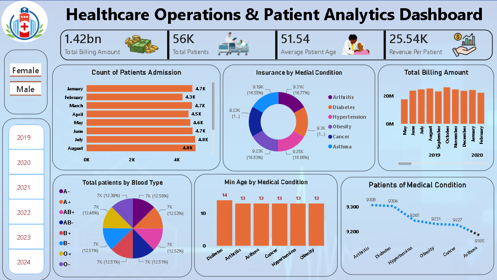

Healthcare Operations & Patient Analytics Dashboard
-
Healthcare Operations & Patient Analytics Dashboard is an end-to-end Power BI project built using a healthcare CSV dataset to analyze patient admissions, billing performance, insurance coverage, medical conditions, and demographic trends.

📍Project Overview
-

The Healthcare Operations & Patient Analytics Dashboard is an end-to-end Business Intelligence solution developed in Power BI using a real-world healthcare dataset. This project transforms raw patient records into meaningful insights by analyzing patient admissions, total billing, revenue per patient, insurance coverage, medical conditions, blood groups, and demographic trends. Interactive filters for gender and admission year enable dynamic exploration of healthcare performance across multiple dimensions. Advanced Power Query transformations, data modeling, DAX measures, and interactive visualizations were used to build a scalable and user-friendly dashboard. This project demonstrates strong skills in data cleaning, ETL, KPI development, business intelligence reporting, and dashboard storytelling, making it highly relevant for real-world healthcare analytics and Data Analyst roles.

---
📊 Key Performance Indicators
- 

- 💰 Total Billing Amount : 1.42 Billion -- Total revenue generated from patient treatments
- 👨‍⚕️ Total Patients : 56,000+  -- Total patient records analyzed across multiple years
- 💵 Average Revenue per Patient : 25.54K  -- The average revenue generated from each patient
- 🎂 Average Patient Age : 51.54 Years  -- Indicates that the majority of patients belong to the middle-aged
- 📈 Highest Monthly Billing :≈ 25M  -- Identifies peak revenue periods to support financial forecasting

---

Tools & Technologies
- 

- Power BI
- Excel/CSV Dataset
- Data Cleaning
- Data Visulization
- Dax Measures
- SQL

---
🎯 Project Objectives
-

- Enable dynamic analysis using Gender and Year filters for better decision-making and trend exploration.
- Transform raw healthcare data into meaningful insights through Power Query, Data Modeling, and DAX calculations.
- Build an executive-friendly dashboard with interactive visualizations to support hospital administrators and business stakeholders.
- Demonstrate end-to-end Business Intelligence, ETL, Data Visualization, and KPI Reporting skills using Power BI.
- Deliver actionable insights that help optimize healthcare operations, improve financial monitoring, and support strategic decision-making.
  
---
  

📈 Key Business Insights
-

- 📊 56K+ patient records analyzed to identify healthcare utilization and operational trends.
- 💰 $1.42B total billing analyzed to evaluate hospital financial performance and revenue generation.
- 👨‍⚕️ Average patient revenue of $25.54K highlights treatment profitability and billing efficiency.
- 🩺 Disease distribution analysis identified key medical conditions driving hospital admissions and resource demand.
- 🛡️ Insurance coverage insights support reimbursement analysis and healthcare cost optimization.
- 📈 Interactive dashboards and KPIs enable data-driven decision-making for hospital administrators through dynamic filtering and executive-level reporting.
  
---

## Dashboard Preview
----

-----
💼 Solution
-
The Healthcare Operations & Patient Analytics Dashboard transforms 56K+ patient records into actionable business insights through an interactive Power BI solution. It enables healthcare stakeholders to monitor $1.42 Billion in total billing, $25.54K average revenue per patient, patient admissions, insurance coverage, and medical condition trends from a single dashboard. With dynamic filters for Admission Year and Gender, users can quickly identify operational patterns and financial performance without manual reporting.By leveraging Power Query, Data Modeling, and DAX, the project automates reporting, improves data accuracy, and converts complex healthcare data into meaningful insights for executive-level decision-making.

---
📬 Connect With Me
- 

- 💼 Role : Aspiring Data Analyst
- 📧 Email :kumarshagun978@gmail.com
- 🔗 LinkedIn :https://www.linkedin.com/in/shagun-8544962a0/
- 📢 Open To Work : Data Analyst | BI Analyst | Business Analyst

-----
